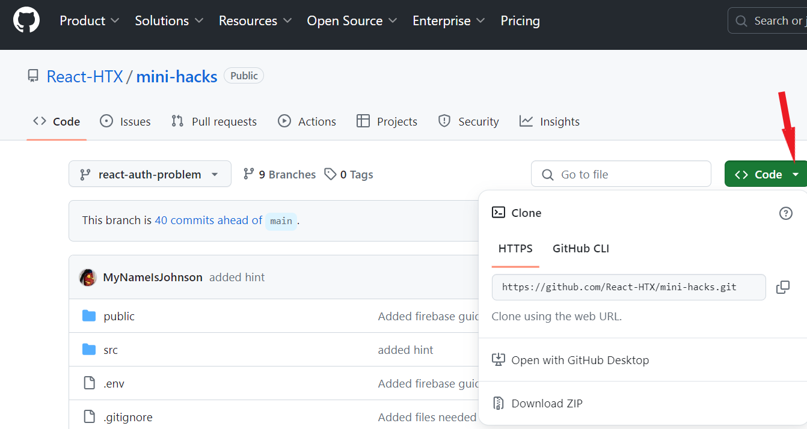
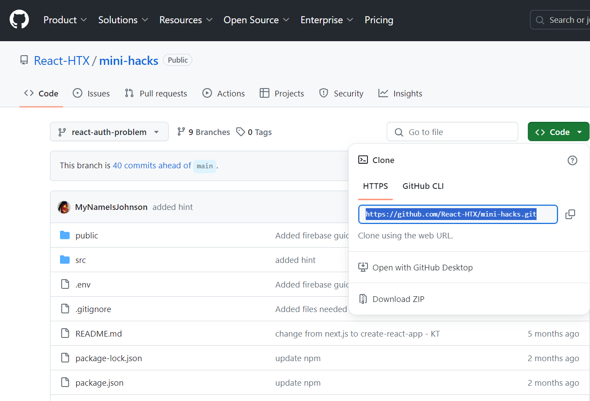
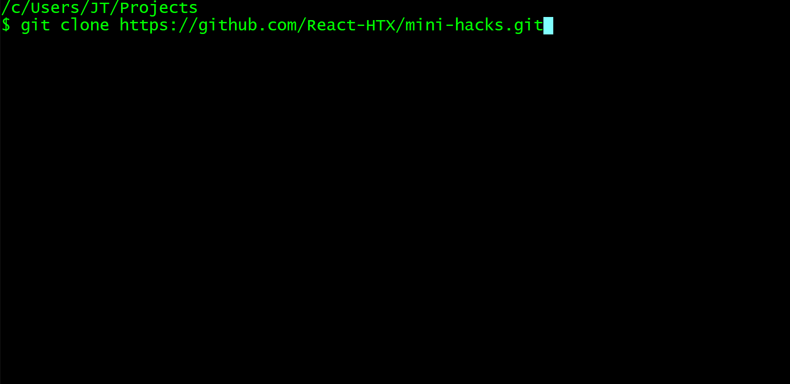
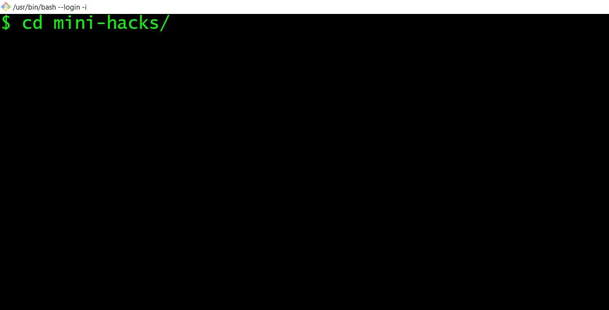

# Getting Started

## Installation

Please make sure you have `git` and `node.js` installed.

- https://git-scm.com/downloads
- https://nodejs.org/en/download/prebuilt-installer

## Clone down (copy) this repository to your local machine.

- Locate the the green button with the characters `<> Code`.

  

- Click on the button and copy the `HTTPS` URL. You could also click on the copy icon to the right of the URL.

  

- Open your terminal and navigate to the directory (like a `Project` folder), you want to clone the repository to.

- Type `git clone` and paste the URL you copied from GitHub.

  

- Then type `cd mini-hacks/`

  

- Type `npm install` to install all the dependencies.

- Once installs are completed, start the project with `npm start`.
